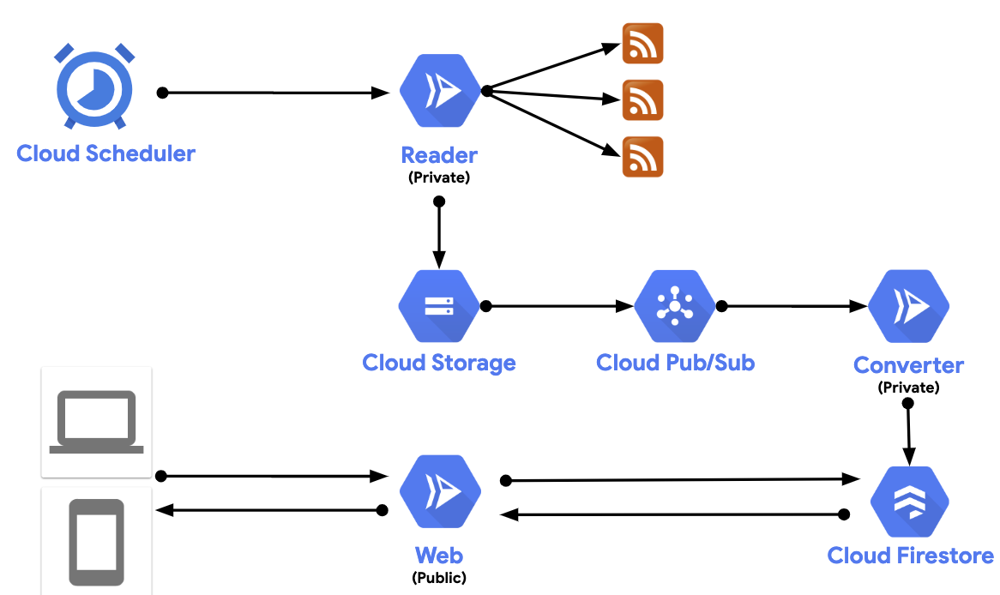

# Amathus

Amathus reads RSS feeds, transforms them into a common feed format, and exposes them behind a Web API. Written in ASP.NET Core and deployed as 3 separate Cloud Run microservices on Google Cloud.

## Architecture



## Setup

Make sure `gcloud` points to the right project and you're in [Amathus](Amathus) folder where [Amathus.sln](Amathus/Amathus.sln) is.

(One time) Enable Google Cloud services needed:

```bash
scripts/enable
```

### Amathus.Reader

Build:

```bash
scripts/build reader
```

Deploy service (public):

```bash
scripts/deploy reader
```

(One time) Create a Cloud Storage bucket and a Scheduler job to invoke the service:

```bash
scripts/setup_reader
```

### Amathus.Converter

Build:

```bash
scripts/build converter
```

Deploy service (private):

```bash
scripts/deploy converter private
```

(One time) Set converter to receive Pub/Sub messages with bucket changes:

```bash
scripts/setup_converter
```

### Amathus.Web

Build:

```bash
scripts/build web
```

Deploy:

```bash
scripts/deploy web
```

## Debugging

## Run locally

Inside [Amathus.Reader](Amathus/Amathus.Reader), [Amathus.Converter](Amathus/Amathus.Converter), or [Amathus.Web](Amathus/Amathus.Web) folder:

```bash
dotnet run
```

## Build and run Docker image locally

Inside [Amathus](Amathus) folder, you can build and run the image for each service. For example, for `Amathus.Web`:

Build image:

```bash
docker build -t amathus-web -f Amathus.Web/Dockerfile .
```

Run image:

```bash
docker run -p 8080:8080 amathus-web
```
