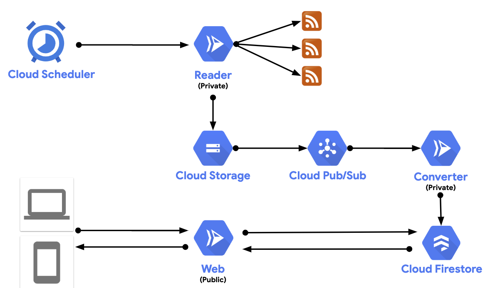

# Amathus

Amathus reads Northern Cyprus (KKTC) RSS news feeds, transforms them into a common feed format, and exposes them behind a Web API with a cross-platform Flutter client (Web, iOS, Android, macOS).

- **Backend (`Amathus/`)**: Written in **C# 14 / ASP.NET Core (.NET 10.0)** and deployed as 3 Cloud Run microservices (`amathus-reader`, `amathus-converter`, `amathus-web`) on Google Cloud (`events-atamel`).
- **Frontend (`AmathusClient/`)**: Written in **Flutter 3.41 / Dart 3.11** (Material 3) and deployed as a Cloud Run web application (`amathus-client`).

## Architecture



1. **`Amathus.Reader` (`amathus-reader`)**: Invoked every 10 minutes by Cloud Scheduler (`amathus-reader-job`). Fetches the 17 active RSS feeds configured in [`Amathus/Shared/amathussources.json`](./Amathus/Shared/amathussources.json) in parallel and uploads raw XML feeds to Cloud Storage (`gs://amathus-events-atamel-bucket`).
2. **`Amathus.Converter` (`amathus-converter`)**: Triggered by Pub/Sub push notifications (`amathus-events-atamel-topic`) on Cloud Storage `OBJECT_FINALIZE` events. Parses and cleans the raw feeds into normalized `Feed` / `FeedItem` documents and stores them in Firestore (`feeds` collection).
3. **`Amathus.Web` (`amathus-web`)**: Public REST API serving `/api/v1/feeds`, `/api/v1/feeditems`, `/api/v1/feeditems/{id}`, and `/api/v1/imageproxy?url=...` (CORS-enabled image proxy for Flutter Web).
4. **`AmathusClient` (`amathus-client`)**: Flutter client for Web, iOS, Android, and macOS.

---

## Local Testing (Backend)

### Run Unit & Functional Feed Tests

From the [`Amathus`](./Amathus) directory:

```bash
dotnet test Amathus.sln
```

### Run `Amathus.Web` Locally (In-Memory Mode)

In `Development` mode (`appsettings.Development.json`), `Amathus.Web` uses `InMemory` storage and automatically runs a background `FeedReaderService` that fetches and converts all 17 RSS feeds on startup without requiring Google Cloud credentials:

```bash
cd Amathus/Amathus.Web
dotnet run --environment Development --urls http://localhost:5002
```

Test the local API endpoints:

```bash
curl http://localhost:5002/api/v1/feeds
curl "http://localhost:5002/api/v1/feeditems?limit=10"
curl http://localhost:5002/api/v1/feeditems/kibrisgazetesi
```

### Build and Run Docker Images Locally

From the [`Amathus`](./Amathus) folder:

```bash
docker build -t amathus-web -f Amathus.Web/Dockerfile .
docker run -p 8080:8080 amathus-web
```

---

## Google Cloud Deployment (`events-atamel`)

Make sure `gcloud` is authenticated and inside the [`Amathus`](./Amathus) folder (`scripts/config` defaults to `PROJECT_ID=events-atamel` and `REGION=europe-west1`).

### 1. Enable Required Google Cloud APIs (One-Time)

```bash
./scripts/enable
```

### 2. Build and Deploy `Amathus.Reader`

```bash
./scripts/build reader
./scripts/deploy reader public
```

Set up the Cloud Storage bucket (`gs://amathus-events-atamel-bucket`) and Cloud Scheduler job (`amathus-reader-job`):

```bash
./scripts/setup_reader
```

### 3. Build and Deploy `Amathus.Converter`

```bash
./scripts/build converter
./scripts/deploy converter public
```

Set up the Pub/Sub topic (`amathus-events-atamel-topic`), Cloud Storage bucket notification, and push subscription (`amathus-events-atamel-topic-subscription`):

```bash
./scripts/setup_converter
```

### 4. Build and Deploy `Amathus.Web`

```bash
./scripts/build web
./scripts/deploy web public
```

### 5. End-to-End Cloud Verification

Run the automated test script to trigger `amathus-reader`, test `amathus-converter`, and verify `amathus-web` endpoints:

```bash
./scripts/test_services
```

---

## Flutter Frontend (`AmathusClient`)

See [`AmathusClient/README.md`](./AmathusClient/README.md) for local development, testing, and Cloud Run web deployment instructions.
